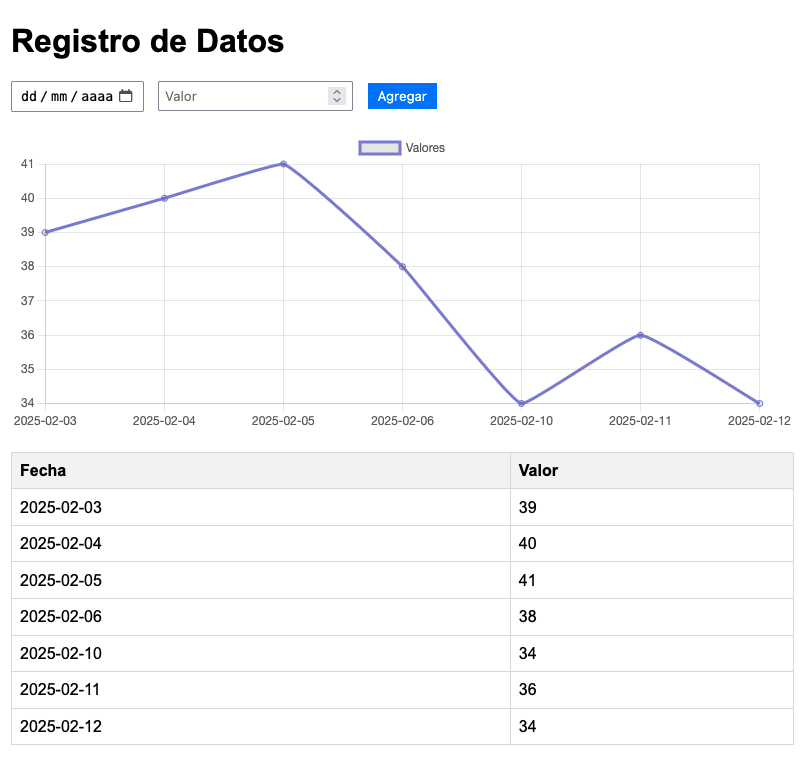

# datachart

El objetivo de esta app es tener una simple aplicación para el registro varios grupos de fecha/valor y generar una grafica con ellos para ver la evolución. 

Los requerimientos son muy basicos, un app html/js que almacene los datos en el mismo navegador y tenag un simple formulario para la introducción de los datos.

Seria, por ejemplo, una aplicación ideal pare ver la evolución de un dato en el tiempo, por ejemplo para llevar el control de peso.

Esta es una vista de la aplicación funcionando en el navegador

He usado Claude 3.5 Sonnet. 

Es una primera versión con la que voy a experimetar como evolucionarla.

El prompt y la conversación mantenida con Claude esta en el [prompts.md](prompts.md)

